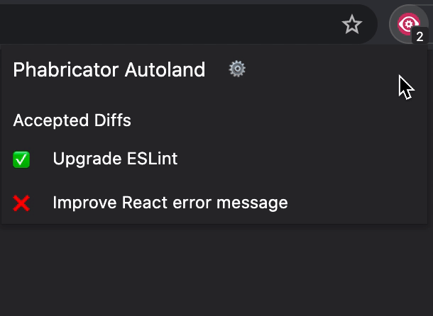

# Phabricator Autoland 

Autoland Phabricator revisions which are ready to land



## Install

* [**Chrome** extension](https://chrome.google.com/webstore/detail/phabricator-autoland/onjafannflphlocdocbajjmnhanhhjil)

## Development

1. Install Node.js dependencies

```
npm install
```

2. Load the `src` directory as [an unpacked extension](https://webkul.com/blog/how-to-install-the-unpacked-extension-in-chrome/)

3. Reload extension with every change. We recommend using the [Extension Reloader](https://chrome.google.com/webstore/detail/extensions-reloader/fimgfedafeadlieiabdeeaodndnlbhid) to make this easier

## Build

`npm run build`


## FAQ

### My diff is ✅ and has the `#autoland` tag, why is it not landing?

* Only when you've been idle for more than 15 seconds (no keyboard or mouse interactions), will the auto land feature kick in. See [`chrome.idle`](https://developer.chrome.com/docs/extensions/reference/idle/) for more information.
* Only repositories which have the experimental `Land Revision` feature enabled will be able to autoland diffs. You can check whether this is the case by going to a diff and verifying you see a `Land Revision` link.<br />


### My diff has a ❌ next to it, what is going on?

Hover over the icon to get more information. For every diff we perform these checks:
* Builds pass
* Active landing operation passes
* The `#autoland` tag is included in the summary
### As a reviewer, how do I ensure a diff doesn't land when it still requires changes?

Make sure to set the status of the diff to `Request Changes`. That way, the autoland won't kick in.

### Will it auto-land even if someone leaves comments?

Yes. In order to block the diff, set the status to `Request Changes`.

### Do I have to leave my PR tab open in order for it to auto-land?

No. The extension will open a new tab in the background for you.

### Do I have to keep the Chrome window open in order for it to auto-land?

Yes. The extension does Chrome to be running.

### Does it take review approval into account?

Yes

### How does the extension work?

1. Ping the phabricator URL on a regular basis to get all the accepted diffs
2. For each accepted diff, check whether the builds have passed
3. If they do and the `#autoland` tag is included in the summary, autoland the diff
4. To autoland the diff, we wait until the user is idle for 15 seconds.
5. If they are idle, open a tab in the background and perform the `Land Revision` action
